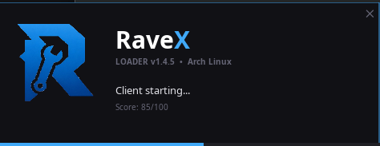
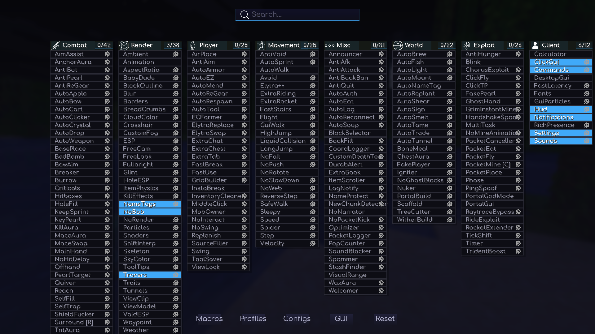
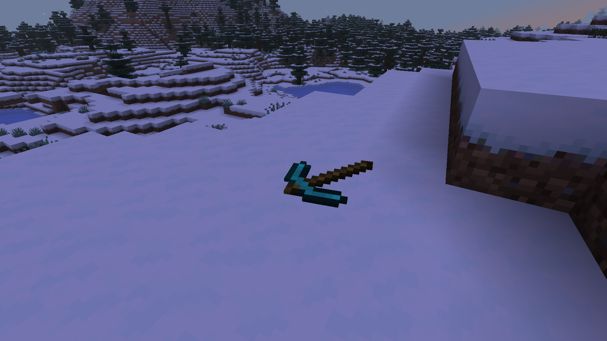
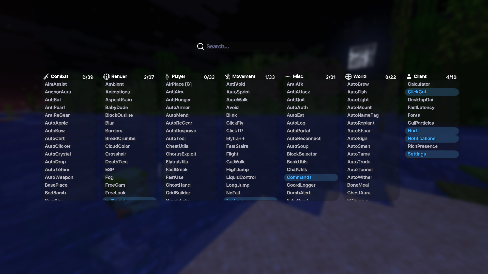

# RaveX

**Разработчик: StormDevzz** (github.com/StormDevzz)

---

## RU

RaveX - клиентский мод для Minecraft от организации StormDevzz.

**Сайт:** https://ravex.serveousercontent.com/

### Языки в проекте

| Язык | Назначение |
|---|---|
| **Java** | Основная логика мода — ClickGUI, модули, миксины, рендеринг |
| **C++** | Нативный код для производительных операций: оптимизатор, анти-AFK, хуки шейдеров, JNI-мост |
| **Lua** | Скриптинг — rich presence, взаимодействие с Discord, кастомные модули и Lua-аддоны |
| **Makefile** | Генерируется CMake для сборки C++ компонентов (native-библиотеки) |

### Скриншоты

| Загрузка | GUI | Физика |
|---|---|---|
|  |  |  |
|  |  | |
| Новое Гуи | Поддержка русского языка | |

### Сборка

```bash
./gradlew build
```

Готовый JAR находится в `build/libs/`.
Готовые сборки также доступны в разделе Releases.

### Верификация

Этот проект полностью с открытым исходным кодом. Любой желающий может самостоятельно собрать jar из исходников и убедиться, что клиент не содержит вредоносного кода:

```bash
git clone https://github.com/StormDevzz/RaveX.git
cd RaveX
./gradlew build
```

sha-256 хеш твоей локальной сборки будет совпадать с хешем официального релиза при условии одинаковой версии кода. Если сомневаешься в бинарнике - собирай сам.

### Установка

1. Установи Fabric Loader
2. Помести JAR в папку `mods`
3. Запусти игру

### Аддоны

Ты можешь создавать собственные Java, C++ и Lua дополнения для RaveX. Подробные руководства по созданию, сборке и установке аддонов доступны в соответствующих папках шаблонов:
* [Руководство по Java-аддонам](templates/java/GUIDE_RU.md) (English version: [Java Addons Guide](templates/java/GUIDE.md))
* [Руководство по C++ нативным аддонам](templates/cpp/GUIDE_RU.md) (English version: [C++ Addons Guide](templates/cpp/GUIDE.md))
* [Руководство по Lua-аддонам](templates/lua/GUIDE_RU.md) (English version: [Lua Addons Guide](templates/lua/GUIDE.md))

### Баги и предложения

Нашёл баг или есть идея? Не стесняйся - создавай Issue!

### Лицензия

GNU General Public License v3.0 - см. файл LICENSE.

---

[English version →](README_EN.md)

