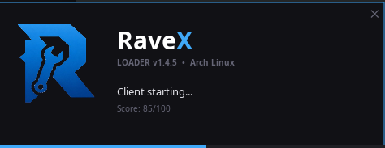
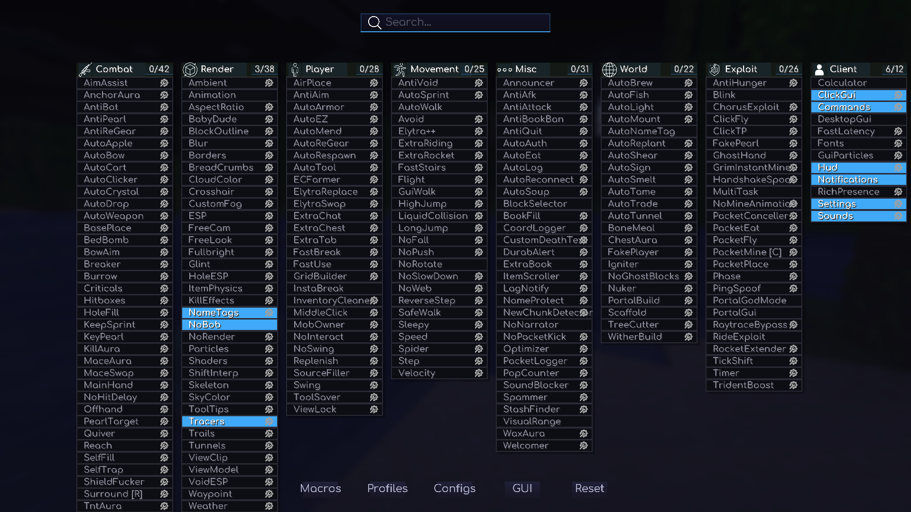
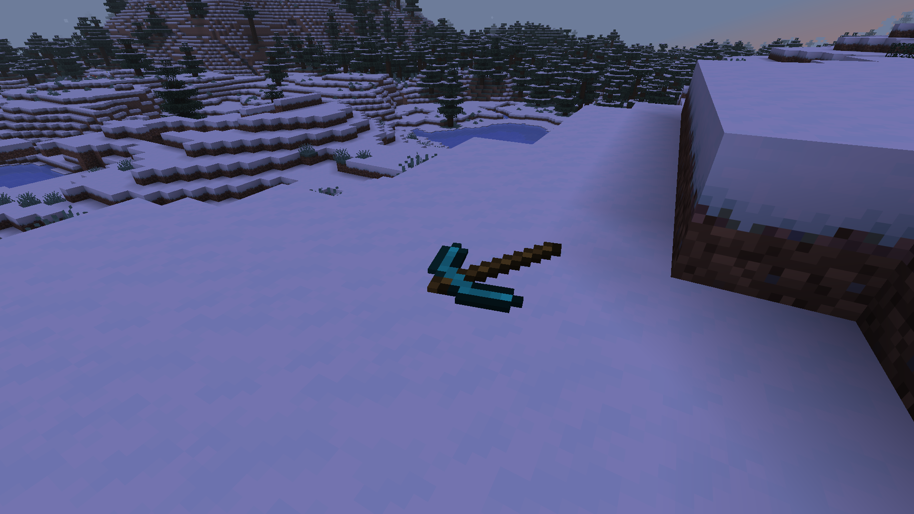
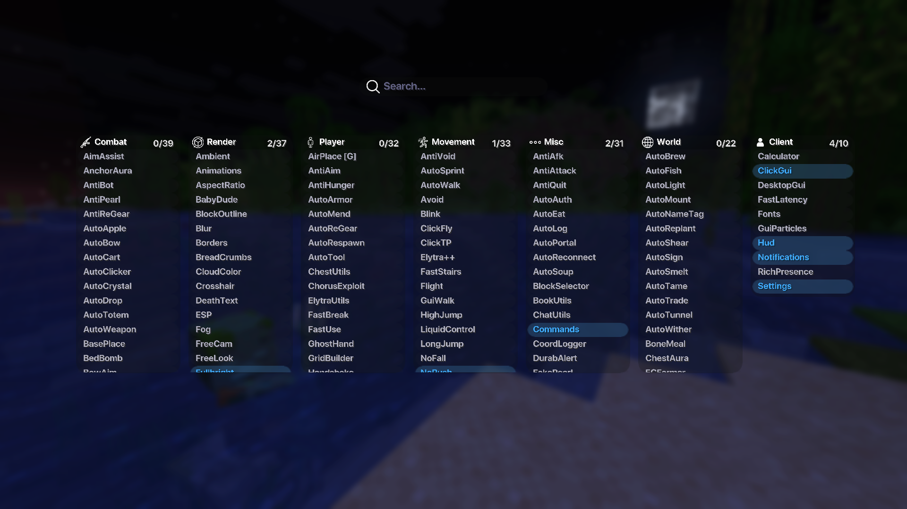

# RaveX

**Сайт / Website:** https://ravex-community.vercel.app/

[](https://t.me/ravex_free)
[](https://discord.gg/n9HPbgN7S)

---

### Скриншоты / Screenshots

| Загрузка / Loading | Гуи / Gui | Физика / Physics | Новое Гуи / New Gui | Русский язык / Russian |
|---|---|---|---|---|
|  |  |  |  |  |

---

## EN

RaveX is an open-source Minecraft client modification by StormDevzz organization.

### Languages in this project

| Language | Purpose |
|---|---|
| **Java** | Core mod logic - ClickGUI, modules, mixins, rendering |
| **C++** | Native code for performance-critical operations: optimizer, anti-AFK, shader hooks, JNI bridge |
| **Lua** | Scripting - rich presence, Discord integration, custom modules and Lua addons |
| **Makefile** | Generated by CMake for building C++ components (native libraries) |

### Building

```bash
./gradlew build
```

The built JAR will be in `build/libs/`.
Pre-built JARs are also available in the Releases section.

### Verification

This project is fully open source. Anyone can build the jar from source and verify the client contains no malicious code:

```bash
git clone https://github.com/StormDevzz/RaveX.git
cd RaveX
./gradlew build
```

The sha-256 hash of your local build will match the official release hash given the same code version. If you don't trust the binary - build it yourself.

### Installation

1. Install Fabric Loader
2. Place the JAR in your `mods` folder
3. Launch the game

### Addons

You can create your own Java, C++ and Lua addons for RaveX. Detailed compilation, creation, and installation guides are available inside the template directories:
* [Java Addons Guide](templates/java/GUIDE.md) (Russian version: [Руководство по Java-аддонам](templates/java/GUIDE_RU.md))
* [C++ Addons Guide](templates/cpp/GUIDE.md) (Russian version: [Руководство по C++ нативным аддонам](templates/cpp/GUIDE_RU.md))
* [Lua Addons Guide](templates/lua/GUIDE.md) (Russian version: [Руководство по Lua-аддонам](templates/lua/GUIDE_RU.md))

### Friends

See [FRIENDS.md](FRIENDS.md).

### Bugs & Suggestions

Found a bug or have an idea? Don't hesitate - open an Issue!

### License

GNU General Public License v3.0 - see [LICENSE](LICENSE).

[Russian version →](#ru)

- Use Java 21+ for building

---

## RU

RaveX - клиентский мод для Minecraft от организации StormDevzz.

### Языки в проекте

| Язык | Назначение |
|---|---|
| **Java** | Основная логика мода - ClickGUI, модули, миксины, рендеринг |
| **C++** | Нативный код для производительных операций: оптимизатор, анти-AFK, хуки шейдеров, JNI-мост |
| **Lua** | Скриптинг - rich presence, взаимодействие с Discord, кастомные модули и Lua-аддоны |
| **Makefile** | Генерируется CMake для сборки C++ компонентов (native-библиотеки) |

### Сборка

```bash
./gradlew build
```

Готовый JAR находится в `build/libs/`.
Готовые сборки также доступны в разделе Releases.

### Верификация

Этот проект полностью с открытым исходным кодом. Любой желающий может самостоятельно собрать jar из исходников и убедиться, что клиент не содержит вредоносного кода:

```bash
git clone https://github.com/StormDevzz/RaveX.git
cd RaveX
./gradlew build
```

sha-256 хеш твоей локальной сборки будет совпадать с хешем официального релиза при условии одинаковой версии кода. Если сомневаешься в бинарнике - собирай сам.

### Установка

1. Установи Fabric Loader
2. Помести JAR в папку `mods`
3. Запусти игру

### Аддоны

Ты можешь создавать собственные Java, C++ и Lua дополнения для RaveX. Подробные руководства по созданию, сборке и установке аддонов доступны в соответствующих папках шаблонов:
* [Руководство по Java-аддонам](templates/java/GUIDE_RU.md) (English version: [Java Addons Guide](templates/java/GUIDE.md))
* [Руководство по C++ нативным аддонам](templates/cpp/GUIDE_RU.md) (English version: [C++ Addons Guide](templates/cpp/GUIDE.md))
* [Руководство по Lua-аддонам](templates/lua/GUIDE_RU.md) (English version: [Lua Addons Guide](templates/lua/GUIDE.md))

### Баги и предложения

Нашёл баг или есть идея? Не стесняйся - создавай Issue!

### Лицензия

GNU General Public License v3.0 - см. файл [LICENSE](LICENSE).

[English version →](#en)

- RaveX supports only Minecraft 1.21.x
